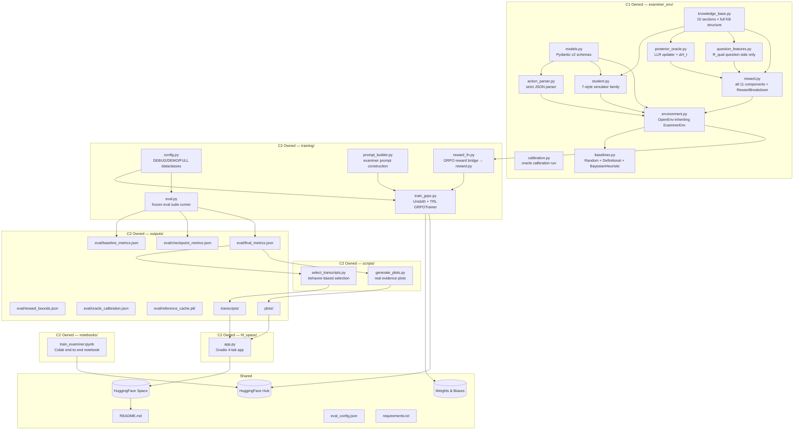

# architecture.md — Complete System Architecture
## The Examiner (BluffBuster) | Source of Truth for All Technical Decisions

> **This document is the technical reference. `guardrails.md` is the authority document. In conflict, `guardrails.md` wins.**

---

## 1. FULL SYSTEM ARCHITECTURE (MERMAID)



---

## 2. DATA FLOW DIAGRAMS

### 2.1 Single Episode Flow

```
reset(seed)
  → samples KNOWS/FAKING partition over S01–S10
  → samples style per section (K1/K2/K3 for KNOWS, F1/F2/F3/F4 for FAKING)
  → initializes PosteriorTracker (p_0(s) = 0.5 ∀ s)
  → initializes dialogue_history = []
  → returns observation: {section_titles, turn=0, remaining_turns=MAX_TURNS, history=[]}

Loop until done:
  model generates text
  → action_parser.parse(text) → AskAction | ClassifyAction | MalformedAction
  → If MalformedAction:
      accumulate P_malformed penalty
      return (obs, 0.0, False, {penalty_info})  [or end if configured]
  → If AskAction:
      validate section_id ∈ {S01–S10} → else P_invalid_sec
      check near-duplicate → else P_repetition
      student.generate_response(question, section_id, profile, kb, turn)
        → detects probe markers in question_text (why/how/edge-case)
        → modulates leak rates: faker mechanism ×0.5, misconception ×1.5
        → assembles response from KB misconceptions / mechanism_cues
        → seeded with (episode_seed, turn, section_id) → deterministic
      posterior_oracle.update(section_id, question, response)
        → evidence = α·mechanism_cue_coverage − γ·misconception_count
        → relevance = β·probe_strength(question)
        → LLR = relevance × evidence, clipped to [−3, +3]
        → posterior = sigmoid(logit(prior) + LLR)
      ΔH_t = H(p_{t-1}) − H(p_t)
      append (section_id, question, response) to history
      return (updated_obs, 0.0, False, {turn_info})
  → If ClassifyAction (or turn exhausted):
      compute_reward(episode_result, kb) → RewardBreakdown
      return (final_obs, R_total, True, {reward_breakdown, posterior_trace})
```

### 2.2 Training Step Flow

```
build_prompt(observation, action_schema_examples)
  → string: section titles + turn info + dialogue history + JSON schema examples
  → NEVER includes: hidden labels, style IDs, posterior values
  → passed to model via GRPOTrainer

model generates K=8 completions per prompt (num_generations=8)

reward_fn(completions, prompts, **kwargs)
  → for each completion:
      action_parser.parse(completion)
      env.step(action) [or compute penalty directly for malformed]
      call compute_reward(episode_result, kb) → R_total
  → return list[float] of R_total values

GRPOTrainer:
  A_i = (R_i − μ_group) / (σ_group + 1e−6)
  clip A_i to [−5, +5]
  compute policy gradient loss
  add KL penalty (β_kl = 0.04)
  optimizer step

W&B log per step:
  episode_reward, R_acc, R_asym, R_cal, R_eff, R_cov, R_info, R_qual, R_div
  P_malformed, P_repetition, P_invalid_sec
  advantage_mean, advantage_std, parse_failure_rate
  posterior_trace (for selected episodes)
```

### 2.3 Full Training Run Flow

```
DEBUG config (smoke test):
  3 sections, 3 turns, 20 episodes, F1 only, Qwen2.5-1.5B
  → verify: finite rewards, non-constant variance, W&B live, parser working
  → Gate: pipeline health confirmed

DEMO config (evidence generation):
  5 sections, 4 turns, 200 episodes, F1+F2 training, F3 held-out, Qwen2.5-7B+Unsloth 4-bit
  → pre-training: baseline eval on frozen 50-episode suite → baseline_metrics.json
  → oracle calibration run: 200 episodes → oracle_calibration.json
  → train: checkpoint every 50 steps → checkpoint_metrics.json
  → post-training: final eval on held-out F3 style + S05 section → final_metrics.json
  → transcript selection: behavior-based (largest R_info gap + correctness flip)
  → plot generation: from real W&B logs
  → Gate: real artifacts exist, trained > Definitional in accuracy
```

### 2.4 Submission Artifact Pipeline

```
outputs/eval/final_metrics.json
  → scripts/select_transcripts.py → before_transcript.json, after_transcript.json
  → scripts/generate_plots.py → outputs/plots/*.png

W&B training run
  → scripts/generate_plots.py → reward curves, per-component curves, ECE curves

outputs/plots/*.png + outputs/transcripts/*.json + outputs/eval/final_metrics.json
  → hf_space/app.py (Gradio 4-tab) → HuggingFace Space (MSR-5)

notebooks/train_examiner.ipynb → HuggingFace Hub (MSR-2)

README.md ← comparison table, plots, 3-sentence narrative, links (MSR-6/7/8)
```

---

## 3. TECH STACK TABLE

| Component | Technology | Version | Justification | MSR |
|-----------|-----------|---------|---------------|-----|
| RL Environment | OpenEnv | latest | Required by hackathon; provides base env class, action/obs space registration | MSR-1 |
| Training | Unsloth + TRL GRPOTrainer | latest | Memory-efficient 4-bit training + GRPO built-in advantage normalization | MSR-2 |
| Training Notebook | Google Colab | — | Judge-runnable without local setup | MSR-2 |
| Base Model | Qwen2.5-7B-Instruct (DEMO) | current HF | Strong instruction following + fits Colab A100 with 4-bit | — |
| Debug Model | Qwen2.5-1.5B-Instruct (DEBUG) | current HF | Smallest viable for smoke testing | — |
| Reward Logging | Weights & Biases | latest | Structured experiment tracking; per-component reward logging | MSR-3 |
| HF Deployment | HuggingFace Spaces + Hub | — | Discoverable, free hosting, judge-accessible | MSR-5/7 |
| Data Validation | Pydantic v2 | ≥2.0 | Strict schema enforcement for actions/profiles | — |
| Demo UI | Gradio | ≥4.0 | Interactive tabs; real-time posterior trace rendering | MSR-5 |
| Action Schema | JSON strict | — | Deterministic parsing; no ambiguity; unit-testable | — |
| Config | Python dataclasses | — | Type-safe; IDE-navigable; no hardcoded hyperparameters | — |

---

## 4. OPENENV INTEGRATION

### Base Classes and Methods

```python
# What ExaminerEnv inherits from OpenEnv:
class ExaminerEnv(OpenEnv):
    # MUST implement:
    def reset(self, seed=None, options=None) -> tuple[obs, info]: ...
    def step(self, action) -> tuple[obs, reward, terminated, truncated, info]: ...

    # MUST define:
    self.action_space     # OpenEnv-compatible space
    self.observation_space  # OpenEnv-compatible space

    # MUST register:
    # openenv.register(id="ExaminerEnv-v0", entry_point="examiner_env.environment:ExaminerEnv")

    # MUST NOT reimplement:
    # - OpenEnv base class methods not listed above
    # - Any internal OpenEnv registry logic
```

**⚠️ CRITICAL: When prompting AI for environment.py, paste the OpenEnv base class interface signature. AI will hallucinate it otherwise and produce a class that fails at import time.**

### Registration Pattern (in `examiner_env/__init__.py`):

```python
import openenv
openenv.register(
    id="ExaminerEnv-v0",
    entry_point="examiner_env.environment:ExaminerEnv",
    max_episode_steps=10,  # MAX_TURNS
)
```

---

## 5. STUDENT SIMULATOR ARCHITECTURE

### StudentProfile Dataclass (Pydantic v2)

```python
class StudentProfile(BaseModel):
    knowledge_mode: Literal["KNOWS", "FAKING"]
    style: Literal["K1", "K2", "K3", "F1", "F2", "F3", "F4"]
    section_id: str  # S01–S10
    verbosity: Literal["brief", "medium", "verbose"]  # sampled
    confidence_pattern: Literal["hedging", "neutral", "confident"]  # style-driven
    mechanism_cue_emit_rate: float  # ∈ [0, 1]
    misconception_emit_rate: float  # ∈ [0, 1]
    style_specific_params: dict  # collapse/mirror/drift/cap fields
    seed: int  # same seed = byte-identical response
```

### 7-Style Family

| Style | Knowledge | mechanism_cue_emit_rate | misconception_emit_rate | Special Param |
|-------|-----------|------------------------|------------------------|---------------|
| K1 | KNOWS | 0.85 | 0.05 | — mechanistic-clear |
| K2 | KNOWS | 0.55 | 0.05 | — concise-expert |
| K3 | KNOWS | 0.65 | 0.08 | — uncertainty-aware |
| F1 | FAKING | 0.15 | 0.30 | collapse_under_mechanism_probe: 0.80 |
| F2 | FAKING | 0.20 | 0.25 | jargon_mirror_rate: 0.70 |
| F3 | FAKING | 0.10 | 0.20 | topic_drift_rate: 0.60 |
| F4 | FAKING | 0.05 | 0.40 | specificity_score_cap: 0.20 |

### Style Sampling Procedure

```
At episode reset(seed):
  for each section s in S01–S10:
    if s in KNOWS_partition:
      style[s] = sample(K1, K2, K3) using RNG(seed, section_idx, "knows")
    else:
      style[s] = sample(F1, F2, F3, F4) using RNG(seed, section_idx, "faking")

Per-section style is sampled INDEPENDENTLY.
Style is NEVER revealed to the examiner.
```

### Probe Sensitivity (Critical for diagnostic signal)

When a "why/how/edge-case/counterexample/application" probe is detected in `question_text`:
- **Faker**: `mechanism_cue_emit_rate × 0.5` (harder to fake mechanisms) AND `misconception_emit_rate × 1.5` (more likely to slip)
- **Knower**: rates unchanged (genuine knowledge holds under pressure)

Detection: keyword regex on `{why, how, mechanism, because, explain, edge case, counterexample, what if, failure, when does, under what, why does, derive}`.

### Response Assembly (Deterministic)

```
KNOWS response:
  RNG(episode_seed, turn, section_id)
  sample mechanism_cues from KB[section].mechanism_cues weighted by cue_strength
  include key_concepts relevant to question
  modulate by verbosity and confidence_pattern

FAKING response:
  RNG(episode_seed, turn, section_id)
  sample misconceptions from KB[section].common_misconceptions weighted by misconception_severity
  apply style_specific_params (collapse / mirror / drift / cap)
  modulate by verbosity

Same (episode_seed, turn, section_id, question_text) = byte-identical response ← required for frozen eval suite.
```

---

## 6. ACTION SCHEMA ARCHITECTURE

### JSON Schema: Ask

```json
{
  "action_type": "ask",
  "section_id": "S01",
  "question_text": "Why does momentum help gradient descent convergence?"
}
```

Constraints:
- `section_id` must be exactly one of `["S01","S02","S03","S04","S05","S06","S07","S08","S09","S10"]`
- `question_text` non-empty, minimum 10 characters
- Near-duplicate to same section in same episode → P_repetition penalty

### JSON Schema: Classify

```json
{
  "action_type": "classify",
  "classifications": {
    "S01": "KNOWS", "S02": "FAKING", "S03": "KNOWS",
    "S04": "FAKING", "S05": "KNOWS", "S06": "FAKING",
    "S07": "KNOWS", "S08": "FAKING", "S09": "KNOWS", "S10": "FAKING"
  }
}
```

Constraints:
- ALL 10 sections required. Missing any → R_cov penalty.
- Labels exactly `"KNOWS"` or `"FAKING"` (case-sensitive). Invalid → P_malformed.
- No `"abstain"`, `"uncertain"`, or any other value.
- Classify always terminates the episode.

### Parser Module (`action_parser.py`)

```python
def parse(text: str) -> AskAction | ClassifyAction | MalformedAction:
    # 1. Try json.loads(text)
    # 2. Check action_type present and valid
    # 3. Dispatch to AskAction or ClassifyAction validator
    # NEVER silently coerce. NEVER strip/modify input before parsing.
    # Returns MalformedAction for ANY invalid output.

def validate(action: AskAction | ClassifyAction,
             canonical_sections: list[str],
             history: list[tuple]) -> ValidationResult:
    # For Ask: check section_id validity, question_text length, near-duplicate
    # For Classify: check all 10 sections present, all labels valid
```

### Unit Test Coverage (required — gate blocker)

Test cases in `tests/test_parser.py`:
1. Empty string → MalformedAction
2. Valid Ask JSON → AskAction
3. Valid Classify JSON (all 10) → ClassifyAction
4. Missing `action_type` → MalformedAction
5. Missing `section_id` in Ask → MalformedAction
6. Wrong label string ("knows" lowercase) → MalformedAction
7. Partial Classify (only 5 sections) → MalformedAction
8. Non-JSON prose → MalformedAction
9. Nested JSON inside a prose string → MalformedAction
10. Near-duplicate Ask same section → ValidationResult with P_repetition flag

---

## 7. REWARD FUNCTION ARCHITECTURE

### Reward Component Reference (canonical source of truth)

All weights, bounds, and formulas below are the **only** valid implementation. Any deviation requires Validator approval and `guardrails.md` update.

```
R_acc   ∈ [−1, +1]       weight: 1.0 (unnormalized, N=10)
R_asym  ∈ [−0.5, 0]      λ_FA=0.5 (false accusation penalty), λ_FE=0.3 (false exoneration)
R_cal   ∈ [−0.4, +0.4]   coefficient: 0.4/N per section
R_eff   ∈ [0, +0.20]     coefficient: 0.20; gated on R_acc > 0
R_cov   ∈ [−0.35, 0]     −0.30 flat + −0.05×(#missing/10)
R_info  ∈ [0, +0.40]     coefficient: 0.40; sum of ΔH_t clipped to [0,1]
R_qual  ∈ [0, +0.10]     coefficient: 0.10; mean over asks
R_div   ∈ [0, +0.05]     coefficient: 0.05
P_malformed ≤ 0          −0.20 per malformed output
P_repetition ≤ 0         −0.10 per near-duplicate ask
P_invalid_sec ≤ 0        −0.10 per invalid section_id
R_total ∈ [−2.05, +1.95]  ASSERT this at compute_reward() end; raise on violation
```

### KB-Grounded Posterior Oracle (§6.1)

```
Initial: p_0(s) = 0.5 ∀ s

After ask(section_id=s, question_text=q) → student_response=r:
  evidence(r, s) = α · mechanism_cue_coverage(r, KB[s]) − γ · misconception_count(r, s)
  relevance(q, s) = β · probe_strength(q, KB[s].probe_templates)
  LLR_t(s) = relevance(q, s) · evidence(r, s)   [clipped to (−3, +3)]
  posterior_t(s) = sigmoid(logit(p_{t-1}(s)) + LLR_t(s))

Sections NOT asked this turn: p_t(s) = p_{t-1}(s)

Default weights: α=1.5, β=0.5, γ=1.0 (overridden per section by oracle_calibration.json)
```

**⚠️ Oracle is used ONLY for:**
1. Shaping R_info (ΔH_t)
2. Computing R_cal terminal margin

**Oracle is NEVER used for:**
- Accuracy grading (always `true_label`)
- Classifying sections (examiner classifies, not oracle)
- Any output visible to the examiner

### Reward Hacking Mitigations

| Hack Strategy | How It's Blocked |
|--------------|-----------------|
| Always predict KNOWS | R_acc + R_asym strictly negative on mixed episodes |
| Repeat same generic question | P_repetition fires; ΔH ≈ 0 → R_info ≈ 0; R_qual ≈ 0 |
| Ask 1 section, guess rest blind | R_info only for asked sections; R_cal ≈ 0 on un-asked |
| End at turn 0 | R_eff=0 (gated on R_acc>0), R_info=0, R_cal≈0 |
| Gibberish output | P_malformed fires every step |
| Style memorization | Held-out style collapses R_info gains on eval |
| Jargon mirroring | R_qual is question-side only; rewards mechanism probes not jargon |
| Posterior gaming via leading Qs | LLR clipped [−3,+3] prevents single-turn explosion |

### `RewardBreakdown` Dataclass (frozen)

```python
@dataclass(frozen=True)
class RewardBreakdown:
    R_acc: float
    R_asym: float
    R_cal: float
    R_eff: float
    R_cov: float
    R_info: float
    R_qual: float
    R_div: float
    P_malformed: float
    P_repetition: float
    P_invalid_sec: float
    R_total: float
    posterior_trace: list[dict[str, float]]   # p_t(s) per turn
    info_gain_per_turn: list[float]           # ΔH_t per turn
```

---

## 8. TRAINING PIPELINE ARCHITECTURE

### Config Tier Table

| Parameter | DEBUG | DEMO | FULL |
|-----------|-------|------|------|
| sections | S01,S02,S03 | S01–S05 | S01–S10 |
| max_turns | 3 | 4 | 6 |
| num_episodes | 20 | 200 | 500 |
| fake_styles (train) | F1 | F1, F2 | F1, F2, F3 |
| eval_styles (held-out) | — | F3 | F4 |
| held_out_sections | — | S05 | S09, S10 |
| eval_episodes | 10 | 50 | 100 |
| model | Qwen2.5-1.5B-Instruct | Qwen2.5-7B-Instruct | Qwen2.5-7B-Instruct |
| lora_rank | 8 | 16 | 16 |
| lora_alpha | 16 | 32 | 32 |
| batch_size | 1 | 2 | 2 |
| grad_accum | 4 | 8 | 8 |
| lr | 5e-6 | 5e-6 | 5e-6 |
| num_generations | 4 | 8 | 8 |
| beta_kl | 0.04 | 0.04 | 0.04 |
| advantage_clip | 5.0 | 5.0 | 5.0 |
| max_seq_length | 1024 | 2048 | 2048 |
| checkpoint_every | 10 | 50 | 50 |
| eval_every | 10 | 50 | 50 |
| bf16 | true | true | true |
| 4bit_quant | true | true | true |

### GRPO Integration Flow

```
GRPOTrainer (TRL):
  reward_fn → calls reward_fn.py → calls examine_env/reward.py
  num_generations = 8: generate 8 rollouts per prompt
  advantage: A_i = (R_i − μ_group) / (σ_group + 1e−6), clipped ±5
  KL: β_kl = 0.04 (increase to 0.10 if σ(R) > 1.5 per 50 episodes)
  reward variance monitor: σ(R) < 0.05 over 50 eps → log warning (degenerate)

reward_fn.py (bridge):
  Input: completions (list[str]), prompts (list[str]), **kwargs
  Output: list[float]  ← one R_total per completion
  Logic: parse action → run env step → compute_reward → return R_total
  NEVER re-implement reward logic here. ALWAYS delegate to reward.py.
```

### Prompt Builder Output

```
You are an examiner. Your goal: determine which of the following ML sections 
a student KNOWS vs FAKING through diagnostic questioning.

Sections: S01 Gradient Descent, S02 Backpropagation, ..., S10 Embeddings

Turn: 2 of 4. Remaining turns: 2.

Dialogue History:
  Turn 1 → Asked S01: "What is gradient descent?"
           Response: "Gradient descent minimizes a loss function..."

Actions: Output ONLY valid JSON matching one of these schemas:
ASK: {"action_type": "ask", "section_id": "S01", "question_text": "..."}
CLASSIFY: {"action_type": "classify", "classifications": {"S01": "KNOWS", ..., "S10": "FAKING"}}

Your output (JSON only):
```

**⚠️ Prompt must NEVER contain:** hidden labels, style IDs, posterior values, any ground-truth information.

---

## 9. EVALUATION ARCHITECTURE

### Frozen Eval Suite Design

```
eval_config.json:
{
  "n_episodes": 50,
  "seeds": [seed_0, seed_1, ..., seed_49],  # fixed, never modified after creation
  "held_out_styles": ["F3"],                 # DEMO config — never used in training
  "training_styles": ["F1", "F2"],
  "held_out_sections": ["S05"],              # DEMO config
  "training_sections": ["S01","S02","S03","S04"],
  "full_eval_styles": ["F4"],               # FULL config held-out
  "full_held_out_sections": ["S09","S10"]
}
```

**Frozen suite is created ONCE (Phase 0) and NEVER modified.**

### Evaluation Metrics (all required per eval run)

| Metric | Description | Source |
|--------|-------------|--------|
| classification_accuracy | overall + per_section | true_label vs. classify action |
| false_accusation_rate | KNOWS → FAKING | true_label |
| false_exoneration_rate | FAKING → KNOWS | true_label |
| avg_turns_to_classify | efficiency proxy | episode step count |
| avg_info_gain_per_turn | mean ΔH_t | posterior_trace from RewardBreakdown |
| terminal_posterior_correctness | sign(p_T−0.5) == truth | RewardBreakdown.posterior_trace |
| calibration_ECE | Expected Calibration Error (10-bin) | p_T vs true_label |
| calibration_brier | Brier score of p_T | p_T vs true_label |
| mean_R_qual | — | RewardBreakdown.R_qual |
| mean_R_info | — | RewardBreakdown.R_info |
| mean_R_cal | — | RewardBreakdown.R_cal |
| parse_failure_rate | #malformed / #steps | RewardBreakdown.P_malformed |
| reward_mean | mean R_total | RewardBreakdown.R_total |
| reward_std | std R_total | RewardBreakdown.R_total |
| per_style_accuracy | per K1/K2/K3/F1/F2/F3/F4 | — |

### Eval Run Schedule

```
Before training: run all 4 baselines → baseline_metrics.json
During training: every 50 steps → checkpoint_metrics.json (append)
After training:  final eval → final_metrics.json
```

---

## 10. TRANSCRIPT SELECTION ARCHITECTURE

Selection logic in `scripts/select_transcripts.py`:

```python
# Load frozen eval results
definitional_results = load_json("outputs/eval/baseline_metrics.json")["DefinitionalExaminer"]
trained_results = load_json("outputs/eval/final_metrics.json")["TrainedExaminer"]

# Find episodes where Definitional was wrong AND Trained was correct (same seed)
flip_episodes = [
    ep for ep in frozen_seeds
    if definitional_results[ep].correct == False
    and trained_results[ep].correct == True
]

# Select episode with largest R_info gap (not episode index)
best_ep = max(flip_episodes,
    key=lambda ep: trained_results[ep].R_info - definitional_results[ep].R_info)

# Export
save(before_transcript, "outputs/transcripts/before_transcript.json")
save(after_transcript, "outputs/transcripts/after_transcript.json")
# Include: episode_seed, ground_truth_revealed, posterior_trace, reward_breakdown
```

---

## 11. HF SPACE ARCHITECTURE (4 TABS)

### Tab 1: Live Episode

- User clicks "Run Episode" → triggers one episode with visible hidden state
- Shows: section titles → each (ask, response) turn → classify → reveal ground truth
- **Live posterior trace**: per-section line chart p_t(s) over turns
- **Per-turn info gain**: bar chart ΔH_t — which questions moved the needle
- After classify: ground truth partition revealed; confident-wrong sections highlighted
- Full reward breakdown: all 11 components, totals

### Tab 2: Baseline vs Trained

- Same episode seed, four examiners: Random | Definitional | BayesianHeuristic | Trained
- Shows questions each asks, student responses, classifications, correctness
- Highlight: trained examiner asks mechanism-probing questions earlier
- Side-by-side posterior traces — visual "trained examiner is more decisive"

### Tab 3: Training Evidence

- All plots from `outputs/plots/` — real W&B data, never synthetic
- R_total curve (mean + std band per eval checkpoint)
- Per-component curves: R_acc, R_info, R_cal, R_qual, R_asym
- Accuracy, false accusation rate, false exoneration rate curves
- avg_info_gain_per_turn curve
- Calibration ECE curve
- Comparison bar chart: 4 examiners × held-out eval suite
- Per-style accuracy heatmap (rows: styles, cols: sections)

### Tab 4: Environment Details

- Student style family diagram with leak rates table
- Action schema JSON examples
- Reward component breakdown with formulas and bounds
- Posterior oracle pseudocode (LLR update equation)
- KB sample — one section fully expanded
- Held-out eval results table

---

## 12. VIBE CODING NOTES PER COMPONENT

### For Each Module: Scaffold Prompt, AI Mistakes, Verification

**`action_parser.py`**
- AI mistake: silently coercing malformed JSON → always return `MalformedAction`, never `try: fix it`
- AI mistake: using `eval()` instead of `json.loads()`
- Verification: run `tests/test_parser.py` → all 10 test cases pass

**`student.py`**
- AI mistake: generating a single scripted student without 7-style branching
- AI mistake: ignoring probe sensitivity modulation (no ×0.5 / ×1.5 logic)
- AI mistake: non-deterministic RNG (forgetting to seed with episode_seed, turn, section)
- Verification: statistical test — F1 to "why" probe shows ≥1 misconception in 80% of 100 samples

**`posterior_oracle.py`**
- AI mistake: improvising weights (e.g., using 1.0/1.0/1.0 instead of 1.5/0.5/1.0)
- AI mistake: forgetting LLR clip to [−3, +3] → posterior explosion
- Verification: same dialogue sequence = identical posterior trace across 3 runs

**`reward.py`**
- AI mistake: improvising reward weights or adding new components not in §6.2
- AI mistake: normalizing R_total inside this function (trainer owns normalization)
- AI mistake: using oracle posterior as accuracy ground truth
- Verification: all-correct episode → R_total ∈ [+0.8, +1.95]; decomposition sums exactly

**`environment.py`**
- AI mistake: reimplementing OpenEnv base class methods
- AI mistake: leaking hidden partition into observation
- Verification: observation dict has no labels, no style IDs, no posterior values

**`train_grpo.py`**
- AI mistake: hallucinating TRL GRPOTrainer API (paste current docs)
- AI mistake: W&B logging via print instead of `wandb.log()`
- AI mistake: inlining reward computation instead of calling `reward_fn.py`
- Verification: W&B dashboard shows 11 separate reward metrics, not just total

**`prompt_builder.py`**
- AI mistake: including hidden partition info in the prompt
- Verification: scan prompt output — no "KNOWS"/"FAKING" labels, no style IDs

---

## 13. FOLDER AND FILE STRUCTURE

See `project_structure.md` for the complete annotated tree. Summary:

```
BluffBuster/
├── examiner_env/         ← C1 owns
├── tests/                ← C1 owns
├── training/             ← C2 owns
├── scripts/              ← C2 owns
├── hf_space/             ← C2 owns
├── notebooks/            ← C2 owns
├── outputs/              ← C2 owns
│   ├── eval/
│   ├── plots/
│   └── transcripts/
├── README.md             ← Shared
├── eval_config.json      ← Shared
├── requirements.txt      ← Shared
├── guardrails.md         ← Validator reads first
├── architecture.md       ← This file
├── implementation_plan.md
├── implementation_coder1.md
├── implementation_coder2.md
├── implementation_validator.md
├── merge_procedure.md
├── project_structure.md
├── submission_checklist.md
├── context_primer.md
└── mistakes.md           ← LOCAL ONLY — in .gitignore
```

---

## 14. ENVIRONMENT VARIABLES AND CONFIG

| Variable | Description | Example |
|----------|-------------|---------|
| `WANDB_API_KEY` | W&B authentication | `"abc123..."` |
| `WANDB_PROJECT` | W&B project name | `"bluffbuster-examiner"` |
| `HF_TOKEN` | HuggingFace API token | `"hf_..."` |
| `OPENENV_PATH` | Path to OpenEnv install (if local) | `"/path/to/openenv"` |
| `TRAINING_CONFIG` | Config tier to use | `"DEBUG"` \| `"DEMO"` \| `"FULL"` |
| `EVAL_CONFIG_PATH` | Path to frozen eval suite config | `"eval_config.json"` |
| `OUTPUTS_DIR` | Base path for all outputs | `"outputs/"` |

All environment variables must be documented in Colab notebook as cell-level comments. No hardcoded secrets.

---

## 15. ⚠️ HUGGINGFACE API PATTERNS AI COMMONLY GETS WRONG

| Pattern | Wrong (AI hallucination) | Correct |
|---------|--------------------------|---------|
| Push model to Hub | `model.push_to_hub("name")` without login | `huggingface_hub.login(token=HF_TOKEN)` first |
| Space deployment | Committing large files directly | Use LFS or URL references for anything >50MB |
| Model card | Generic README.md | Requires `---\ntags:\n  - reinforcement-learning\n---` YAML front matter |
| `push_to_hub` deprecation | `trainer.push_to_hub()` old API | Use `model.push_to_hub()` + `tokenizer.push_to_hub()` separately |
| Space environment vars | Setting in code | Set in Space Settings → Variables tab |
| Gradio blocks | `gr.Interface` for multi-tab | Use `gr.Blocks()` with `gr.Tab()` |
| Gradio state | Global variables | Use `gr.State()` for per-session state |

---

*Last updated: 2026-04-25 | Version 1.0 | Consistent with guardrails.md v1.0*
