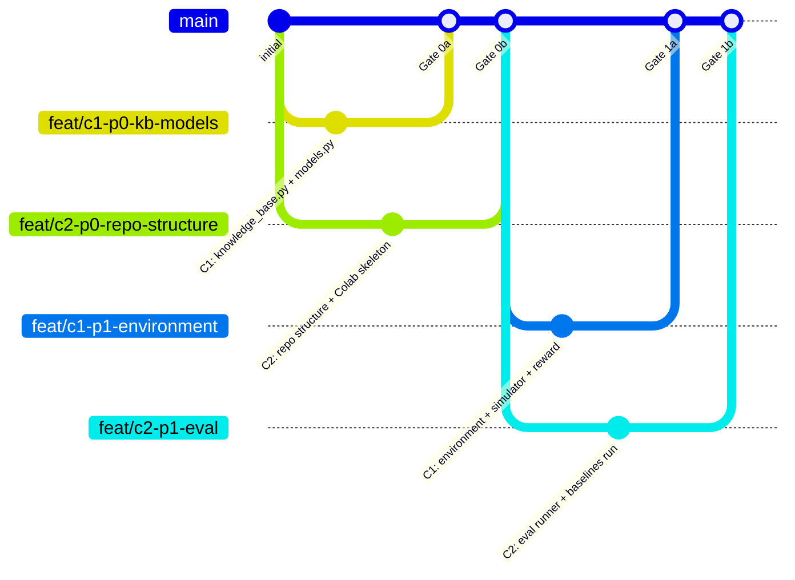

# merge_procedure.md — Git Collaboration Protocol
## The Examiner (BluffBuster) | Zero-Ambiguity Version Control

> **No direct commits to main. No force push. Validator approves all merges. File ownership is absolute.**

---

## BRANCH MAP



---

## BRANCH NAMING CONVENTION

```
feat/c1-[phase]-[feature-slug]     ← C1's feature branches
feat/c2-[phase]-[feature-slug]     ← C2's feature branches
validate/phase-[n]-[YYYYMMDD]      ← Validator review branches (read-only)
hotfix/[issue-slug]                ← Emergency fixes (Validator-approved only)
```

**Examples:**
- `feat/c1-p0-kb-models` — C1's Phase 0 KB + models work
- `feat/c1-p1-environment` — C1's Phase 1 environment
- `feat/c2-p0-repo-skeleton` — C2's Phase 0 structure
- `feat/c2-p2-training-grpo` — C2's Phase 2 training script
- `validate/phase-1-20260426` — Validator's Phase 1 gate branch

---

## MERGE GATE SCHEDULE

| Gate | Trigger Condition | Phase | MSRs Verified | Validator Time |
|------|------------------|-------|---------------|----------------|
| Gate 0 | C1 passes parser tests; C2 has Colab skeleton + W&B live | Phase 0 complete | MSR-1 partial, MSR-2 partial | 15 min |
| Gate 1 | All unit tests pass; oracle calibration ≤ 0.18 Brier; single episode end-to-end | Phase 1 complete | MSR-1 fully | 45 min |
| Gate 2 | DEBUG smoke test checklist green; W&B shows 11 per-component rewards | Phase 2 complete | MSR-2 partial, MSR-3 partial | 20 min |
| Gate 3 | real final_metrics.json; real plots; behavior-selected transcripts | Phase 3 complete | MSR-3 fully | 30 min |
| Gate 4 | HF Space live incognito; Colab clean run; README complete | Phase 4 complete | MSR-2, MSR-5, MSR-6, MSR-7, MSR-9 | 30 min |
| Gate 5 | writeup published; all 9 MSRs confirmed | Phase 5 complete | All 9 MSRs | 10 min |

---

## COMPLETE MERGE PROCEDURE (10 STEPS — NO EXCEPTIONS)

### Step 1: Local sanity checks (coder's responsibility)

Before opening a PR, run locally:
```bash
# For C1 (after any environment change):
pytest tests/ -v --tb=short
# All tests must exit 0

# Quick reward bounds smoke:
python -c "
from examiner_env.environment import ExaminerEnv
from examiner_env.baselines import RandomExaminer
from examiner_env.knowledge_base import KB
from training.config import DEBUG_CONFIG
import json, numpy as np

env = ExaminerEnv(config=DEBUG_CONFIG, kb=KB)
ex = RandomExaminer()
rewards = []
for seed in range(5):
    obs, _ = env.reset(seed=seed)
    done = False
    while not done:
        action = ex.act(obs)
        obs, r, t, tr, info = env.step(json.dumps(action))
        done = t or tr
    rewards.append(r)
print('Rewards:', rewards)
assert all(-2.05 <= r <= 1.95 for r in rewards), 'Out of bounds!'
assert all(np.isfinite(r) for r in rewards), 'Non-finite!'
print('Sanity: PASS')
"
```

The 3 sanity conditions from the task definition must ALL be true.

### Step 2: Open pull request

```bash
git push origin feat/[your-branch]
# Open PR on GitHub:
# Title: [type] [C1/C2/VAL] | phase-[n] | [feature] | [AI tool] | MSR:[n] | [PASS/FAIL sanity]
# Assign: Validator as reviewer
# Add description: list the 3 sanity conditions and their results
```

### Step 3: Validator runs AI code review prompt

Validator pastes the relevant section of code into a code review prompt (see `implementation_validator.md` for specific prompts per gate). Reviews for:
- Correctness against `architecture.md` spec
- No banned patterns (see `guardrails.md` §3)
- File ownership compliance

### Step 4: Validator runs gate-specific MSR checks

See `implementation_validator.md` gate review sections. Each gate has specific verification commands to run.

### Step 5: Validator runs RL-specific manual checks

From the checklist in `implementation_validator.md` §RL-SPECIFIC. All 19 items checked against current codebase state.

### Step 6: 🔴 Blockers → no merge

If any finding is severity 🔴:
- Validator posts specific failing condition in PR review
- PR is marked "Changes Requested"
- Coder fixes the issue on the same feature branch
- Validator re-reviews only the failing condition
- Cycle repeats until all 🔴 findings resolved

### Step 7: 🟡 Degraded findings → merge with note

If findings are only 🟡 (no 🔴):
- Log in `mistakes.md` (Validator adds entry with mistake index number)
- Create follow-up task in `implementation_plan.md` if needed
- Proceed to Step 8

### Step 8: Validator approves PR

GitHub: "Approve" (green checkmark). Comment with gate verdict form from `implementation_validator.md`.

### Step 9: Squash merge to main

```bash
# On GitHub: use "Squash and merge" (not "Create a merge commit")
# Commit message format (see below)
```

### Step 10: All 3 team members pull latest main

```bash
git checkout main
git pull origin main
# Confirm: git log --oneline -3
```

---

## COMMIT MESSAGE FORMAT

```
[type] [owner] | phase-[n]-stage-[id] | [feature] | [AI tool] | MSR:[n,n] | [sanity]
```

**Types:**
- `feat` — new feature or module
- `fix` — bug fix
- `integrate` — wiring two modules together
- `validate` — gate-clearing validation commit
- `docs` — documentation only
- `config` — configuration change
- `train` — training run artifacts or scripts
- `deploy` — HF Space / HF Hub deployment

**Examples:**
```
feat C1 | phase-0-stage-0.2 | models.py Pydantic v2 schemas | Claude | MSR:1 | PASS all 3 sanity
feat C1 | phase-1-stage-1.1 | student.py 7-style simulator | Cursor | MSR:1 | PASS K1>F1 differentiation
fix C1 | phase-1-stage-1.3 | posterior_oracle LLR clip fix | Claude | MSR:1 | PASS trace determinism
feat C2 | phase-2-stage-2.3 | train_grpo.py Unsloth+TRL | Copilot | MSR:2 | PASS 5 steps no crash
validate VAL | phase-1 | Gate 1 clear | — | MSR:1 | PASS all 10 gate conditions
train C2 | phase-3-stage-3.1 | DEMO run 200ep | — | MSR:3 | PASS final_metrics.json exists
deploy C2 | phase-4-stage-4.1 | HF Space 4 tabs | Cursor | MSR:5 | PASS incognito all tabs
```

---

## HUGGINGFACE SYNC PROTOCOL

### HF Space pushes (separate from GitHub commits)

**Owner:** C2 only. No HF Space pushes without Validator gate clearance.

```bash
# After Gate 4 is cleared:
cd hf_space/
git init
git remote add space https://huggingface.co/spaces/[your-org]/bluffbuster-examiner
git add .
git commit -m "deploy: HF Space v1.0 — 4 tabs, real training data"
git push space main
```

**Pre-push checklist:**
```
[ ] Gate 4 cleared by Validator
[ ] README.md has required YAML front matter (---\ntitle: ... sdk: gradio\n---)
[ ] requirements.txt in hf_space/ folder
[ ] outputs/plots/ included (real plots)
[ ] No video files (grep -r ".mp4\|.mov" hf_space/ → empty)
[ ] App tested in incognito before push
```

### HF Hub model pushes

**Owner:** C2 only. After Phase 3 Gate cleared.

```python
# In Colab notebook (after training complete):
from huggingface_hub import login
login(token=HF_TOKEN)

model.push_to_hub("your-org/bluffbuster-examiner-model")
tokenizer.push_to_hub("your-org/bluffbuster-examiner-model")
```

**NEVER include video files in any HF Hub commit (MSR-9).**

---

## PROHIBITED ACTIONS

| Action | Why | Consequence |
|--------|-----|-------------|
| Direct commit to `main` | Bypasses review | Immediate revert; log in mistakes.md |
| `git push --force` | Rewrites history | Prohibited without all-3 consent |
| Generating code in files outside owned scope | Cross-ownership | Revert; Validator reviews |
| HF Space push before gate clearance | Bypasses QA | Revert Space; re-test |
| Committing `mistakes.md` | Must be local | Remove from history; add to `.gitignore` |
| Committing `.env` or credentials | Security | Immediate revoke and rotate credentials |

---

## .gitignore REQUIRED ENTRIES

The `.gitignore` must include:
```
mistakes.md
.env
*.env
__pycache__/
*.pyc
*.pyo
outputs/eval/oracle_calibration.json  # generated locally, not committed
outputs/eval/reference_cache.pkl       # generated locally
*.mp4
*.mov
*.avi
*.mkv
.DS_Store
```

**`mistakes.md` MUST be in `.gitignore`. Verify:**
```bash
git check-ignore -v mistakes.md
# Should output: .gitignore:1:mistakes.md  mistakes.md
```

---

## EMERGENCY PROCEDURES

### If main is broken (tests fail on main)

1. Validator creates `hotfix/[issue]` branch immediately
2. C1 or C2 (owner of the broken code) fixes on hotfix branch
3. Validator reviews hotfix branch (abbreviated review — 5 min max)
4. Squash merge to main with message `hotfix [C1/C2] | [file] | [description of bug]`
5. Log in `mistakes.md`

### If W&B run is lost / corrupted

1. Do NOT re-run and pretend the results are from the original run
2. Document the loss honestly in `mistakes.md`
3. Re-run from last checkpoint if available
4. If no checkpoint: re-run full DEMO config, note new W&B run ID

### If HF Space is accidentally broken

1. Do NOT force-push placeholder content
2. Revert to last working commit on HF Space
3. Fix locally, test in incognito, then re-push with gate clearance

---

*Last updated: 2026-04-25 | Version 1.0 | Consistent with guardrails.md v1.0*
